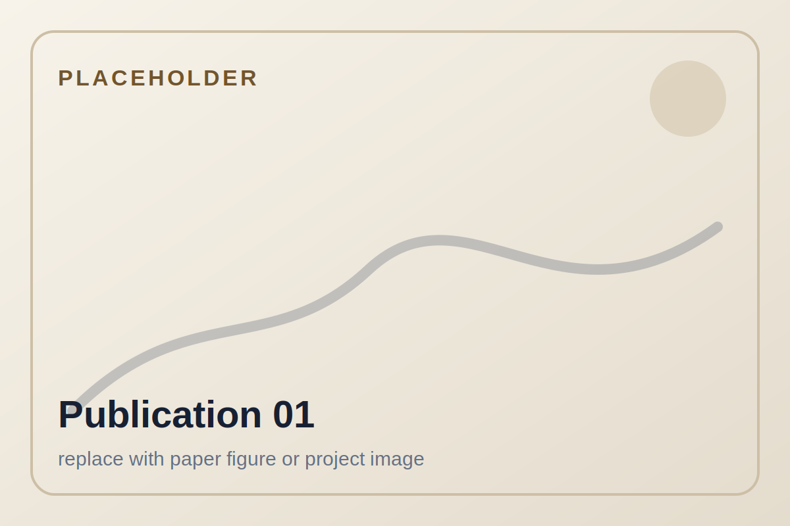

# Codex handoff: Tobias Recker research profile website

This file summarizes the design decisions, content decisions, technical setup, and open tasks for continuing the website in Codex.

## Project goal

Build and maintain a personal research profile website for Dr.-Ing. Tobias Recker.

The site should not be a CV. It should explain the research profile, show projects, show selected publications, provide dissertation access, and make it easier to share a compact research overview with conference contacts, collaborators, and students.

The intended style is academic, elegant, minimal, desktop first, and still usable on mobile.

## Repository and deployment

Repository:

```text
https://github.com/TobiasRecker/tobiasrecker.github.io
```

Live site:

```text
https://tobiasrecker.github.io/
```

GitHub username:

```text
TobiasRecker
```

Repository name should remain lowercase:

```text
tobiasrecker.github.io
```

The site uses Quarto and GitHub Pages.

Important deployment decision:

Use local rendering with Quarto and publish the rendered `docs/` directory from the `main` branch. GitHub Pages should be configured as:

```text
Settings -> Pages -> Source: Deploy from a branch
Branch: main
Folder: /docs
```

Do not rely on GitHub Actions for rendering right now. GitHub Actions failed while downloading actions from codeload GitHub. The robust current workflow is local render and push.

Typical local workflow:

```bash
cd ~/Webpage/tobiasrecker.github.io
quarto preview
quarto render
git add .
git commit -m "Describe change"
git push
```

`_quarto.yml` should contain:

```yaml
output-dir: docs
```

If `.github/workflows/publish.yml` still exists and causes red workflow runs, it can be removed or disabled because deployment is currently from `main/docs`.

The README has been updated to describe the local render plus `main/docs` deployment workflow. `README_UPDATE_v0.2.md` should remain internal and should not be rendered into `docs/`. `_quarto.yml` restricts rendering to `*.qmd` pages for this reason.

## Current project structure

Expected structure:

```text
_quarto.yml
index.qmd
research.qmd
projects.qmd
publications.qmd
dissertation.qmd
about.qmd
contact.qmd
privacy.qmd
styles.css
robots.txt
assets/
  images/
  pdfs/
  data/
docs/
```

Important image files from the first version:

```text
assets/images/tobias-recker-portrait.jpg
assets/images/project-object-handling.jpg
assets/images/project-object-transport.jpg
assets/images/project-additive-manufacturing.jpg
assets/images/thumb-object-handling.jpg
assets/images/thumb-object-transport.jpg
assets/images/thumb-additive-manufacturing.jpg
assets/images/og-image.jpg
```

Dissertation PDF:

```text
assets/pdfs/recker-dissertation-2025.pdf
```

Publication placeholder images from v0.2:

```text
assets/images/publications/pub-01-placeholder.svg
assets/images/publications/pub-02-placeholder.svg
assets/images/publications/pub-03-placeholder.svg
assets/images/publications/pub-04-placeholder.svg
assets/images/publications/pub-05-placeholder.svg
assets/images/publications/pub-06-placeholder.svg
assets/images/publications/pub-07-placeholder.svg
assets/images/publications/pub-08-placeholder.svg
assets/images/publications/pub-09-placeholder.svg
assets/images/publications/pub-10-placeholder.svg
assets/images/publications/pub-11-placeholder.svg
```

The first five displayed publications now use real images copied from the user's compressed image export:

```text
assets/images/publications/pub-01-design-control.png
assets/images/publications/pub-02-scaling-object-handling.png
assets/images/publications/pub-03-print-while-drive.png
assets/images/publications/pub-04-formation-geometries.png
assets/images/publications/pub-05-valet-parking.png
```

Four additional publication images were copied from the user's second compressed image export:

```text
assets/images/publications/pub-06-inline-reinforcement.png
assets/images/publications/pub-07-time-efficient-path-planning.png
assets/images/publications/pub-08-mobile-additive-manufacturing.png
assets/images/publications/pub-09-smooth-spline.png
```

Publication images are clickable and use the same lightbox script as the project gallery:

```text
assets/site.js
```

The publication "Comparison of Global Path Planning Algorithms regarding Multi Mobile Robot Object Transport Requirements" is intentionally hidden for now.

The publication "A Spatial Multi-layer Control Concept for Strand Geometry Control in Robot-Based Additive Manufacturing Processes" is intentionally hidden from the homepage publication overview for now. It may remain on the dedicated publications page.

Gallery placeholder images from v0.2:

```text
assets/images/gallery/gallery-04-placeholder.svg
assets/images/gallery/gallery-05-placeholder.svg
assets/images/gallery/gallery-06-placeholder.svg
```

The homepage gallery now uses the real local gallery images for the last three slots:

```text
assets/images/gallery/Gallery04.jpg
assets/images/gallery/Gallery05.jpg
assets/images/gallery/Gallery06.jpg
```

The homepage gallery uses all six local gallery images in this order:

```text
Gallery04.jpg -> High-payload cooperative handling
Gallery03.jpg -> Cooperative handling demonstrator
Gallery06.jpg -> Multi-axis material testing
Gallery01.jpg -> Scalable repair for large drives
Gallery05.jpg -> Scalable automotive repair
Gallery02.jpg -> Cooperative door removal
```

Gallery items are clickable. They open a native dialog lightbox with the full image, a title, a short description, and previous or next controls. The homepage loads the script from:

```text
assets/site.js
```

The homepage portrait area intentionally uses a stacked-image treatment. The front portrait remains:

```text
assets/images/tobias-recker-portrait.jpg
```

The rear stack image is:

```text
assets/images/tobias-recker2.jpg
```

The portrait stack is clickable and toggles which image is in front.

## Personal and professional information

Name on website:

```text
Dr.-Ing. Tobias Recker
```

Role:

```text
Postdoctoral Researcher
```

Institution:

```text
Institute of Assembly Technology and Robotics
Leibniz University Hannover
```

Institution URL:

```text
https://www.match.uni-hannover.de/en/
```

University profile:

```text
https://www.match.uni-hannover.de/en/institute/team/tobias-recker
```

GitHub:

```text
https://github.com/TobiasRecker
```

LinkedIn:

```text
https://de.linkedin.com/in/tobias-recker-14349521b
```

Scopus profile:

```text
https://www.scopus.com/authid/detail.uri?authorId=57216780652
```

ORCID:

```text
0000-0003-1632-0538
https://orcid.org/0000-0003-1632-0538
```

No Google Scholar profile is available at the moment.

Contact email should be privacy friendly and obfuscated:

```text
recker [at] match.uni-hannover.de
```

Do not add private address, phone number, birth date, or unnecessary personal details.

## Language and writing style

The website should be English only.

Visible website copy should be concise, clear, and academic, but not overly formal.

Avoid visible punctuation dashes used as sentence punctuation. Specifically avoid em dashes and en dashes in running text. Also avoid semicolons in visible website copy.

Hyphenated technical terms are acceptable when needed, for example:

```text
multi-robot
path-planning
system-integration
```

But do not use long dash constructions such as:

```text
one adaptable robotic system — especially ...
```

Replace such constructions with commas, parentheses, or separate sentences.

Also avoid phrases that suggest the robots "share objects". The intended meaning is that multiple robots handle one common object.

Preferred wording:

```text
one common object
```

Avoid:

```text
shared objects
robots that share objects
```

## Core research positioning

Preferred one sentence profile, in first person:

```text
I develop scalable cooperative mobile multi-robot systems for industrial handling, assembly, and construction automation.
```

Current intended hero follow-up:

```text
I design control, trajectory planning, and system integration approaches for tightly coupled robotic cooperation. My focus is on tasks where multiple mobile robots handle one common object and where no individual robot could complete the task alone, even given unlimited time.
```

Research focus explanation should include these ideas:

1. The work is about tightly coupled cooperation.
2. It focuses on scenarios where multiple mobile robots cooperate on one task that cannot be performed by one robot alone, even sequentially with unlimited time.
3. The robots handle one common object.
4. The motivation is not only avoiding single purpose machines in general. The deeper motivation is that highly specialized robots often have low utilization when the available task spectrum is too broad and there are not enough tasks to justify many specialized machines.
5. The research aims to improve scalability, adaptability, and utilization by using cooperative robotic systems.

A good current paragraph:

```text
My work is centered on tightly coupled cooperation between mobile robots. I focus on scenarios where several robots handle one common object and coordinate their motion so closely that the task only exists as a team task. This is especially relevant for broad task spectra in which highly specialized robots would be expensive, underutilized, and difficult to justify.
```

Core research topics:

```text
Mobile manipulation
Multi-robot systems
Automation for construction
```

Keywords:

```text
Manipulation
Control
Trajectory planning
Robot learning
Hardware and system integration
Mobile manipulation
Cooperative multi-robot systems
Formation control
Construction automation
Scalable production
```

Use "hardware and system integration" rather than just "Hardwareintegration".

## Projects

The website should feature three primary projects.

### 1. Cooperative object handling

Video:

```text
https://www.youtube.com/watch?v=7jzTUw5pK40
```

Preferred image from user upload:

```text
8R.png
```

Current local thumbnail:

```text
assets/images/thumb-object-handling.jpg
```

Current project image:

```text
assets/images/project-object-handling.jpg
```

Short description:

```text
Multiple mobile manipulators jointly grasp and move one common object in a spatial workspace.
```

Important technical themes:

```text
multi-manipulator object handling
admittance based control
kinematic overdetermination
adaptation to object sizes, shapes, and weights
experiments with up to eight manipulators
```

### 2. Cooperative object transport

Video:

```text
https://www.youtube.com/watch?v=f0-cd06wfmM
```

Preferred image from user upload:

```text
IMG_9902.jpg
```

Current local thumbnail:

```text
assets/images/thumb-object-transport.jpg
```

Current project image:

```text
assets/images/project-object-transport.jpg
```

Short description:

```text
Mobile platforms coordinate formation motion to transport large industrial components.
```

Important technical themes:

```text
formation control
nonholonomic mobile robots
semi-rigid formations
path curvature constraints
tracking error
object slippage
large-scale object transport
```

### 3. Print-while-drive additive manufacturing

Video:

```text
https://www.youtube.com/watch?v=IAT_a7R-n6Y
```

Preferred image from user upload:

```text
Bauschaumwand_mit_Lukas.jpg
```

Current local thumbnail:

```text
assets/images/thumb-additive-manufacturing.jpg
```

Current project image:

```text
assets/images/project-additive-manufacturing.jpg
```

Short description:

```text
A mobile manipulator coordinates platform and arm motion for continuous large-scale additive manufacturing.
```

Important technical themes:

```text
mobile additive manufacturing
print-while-drive processes
offline platform trajectory planning
coordinated platform and manipulator motion
construction automation
large-scale robotic fabrication
```

## Video and privacy policy

Do not embed YouTube videos with iframes by default.

Use local thumbnails with a play button overlay. The click should open YouTube in a new tab with:

```html
target="_blank" rel="noopener"
```

Reason: privacy friendly, no third-party tracking until the user explicitly clicks.

No analytics, no cookies, no external Google Fonts, and no automatic external embeds.

## Project gallery

The user wants a visual gallery fairly high on the homepage, ideally after `Featured projects`.

Purpose:

Show cool project photos, not necessarily explain every detail.

Current v0.2 gallery concept:

```markdown
## Project gallery

A visual overview of selected demonstrators and experimental setups. The last images are placeholders and can be replaced once the final project photos are selected.
```

Initial gallery items:

```text
Cooperative object handling -> assets/images/project-object-handling.jpg
Cooperative object transport -> assets/images/project-object-transport.jpg
Mobile additive manufacturing -> assets/images/project-additive-manufacturing.jpg
Manipulator detail -> placeholder
Experimental setup -> placeholder
Large-scale component handling -> placeholder
```

Use CSS class:

```text
gallery-grid
```

Expected layout:

Desktop: 3 columns.
Mobile: 1 or 2 columns depending on width.

## Publications

The user wants several publications directly on the homepage, not only one. It is acceptable because the publications are further down. The dissertation block should be moved below the selected publications.

Each publication should have an image in the same row. For now use placeholder images. The user will later provide correct images.

Use horizontal cards on desktop:

```html
<article class="publication-card">
  
  <div class="publication-body">
    ...
  </div>
</article>
```

Use stacked cards on mobile.

Homepage heading should be plural:

```text
Selected publications
```

Not:

```text
Selected publication
```

### Publication list requested by user

The user gave these Scopus publication links and wants them shown, at least initially:

```text
https://www.scopus.com/pages/publications/105018301887?origin=resultslist
https://www.scopus.com/pages/publications/105018298562?origin=resultslist
https://www.scopus.com/pages/publications/105003730449?origin=resultslist
https://www.scopus.com/pages/publications/105001689090?origin=resultslist
https://www.scopus.com/pages/publications/85208425601?origin=resultslist
https://www.scopus.com/pages/publications/85208256597?origin=resultslist
https://www.scopus.com/pages/publications/85208227409?origin=resultslist
https://www.scopus.com/pages/publications/85203002826?origin=resultslist
https://www.scopus.com/pages/publications/85174399024?origin=resultslist
https://www.scopus.com/pages/publications/85131663569?origin=resultslist
https://www.scopus.com/pages/publications/85141743121?origin=resultslist
```

Current mapped publication entries from v0.2. Verify against Scopus or institutional publication list before making major metadata changes.

1. Design and control of flexible handling systems based on mobile cooperative multi-robot-systems

```text
Tobias Recker, Annika Raatz. CIRP Annals, Volume 74, Issue 1, pp. 25-29, 2025.
DOI: https://doi.org/10.1016/j.cirp.2025.04.059
Scopus: https://www.scopus.com/pages/publications/105018301887?origin=resultslist
```

2. Scaling Cooperative Mobile Multi-Robot Systems for Object Handling

```text
Tobias Recker, Lukas Lachmayer, Annika Raatz. 2025 IEEE 21st International Conference on Automation Science and Engineering (CASE), Los Angeles, CA, USA, pp. 2562-2567.
DOI: https://doi.org/10.1109/CASE58245.2025.11163753
Video: https://www.youtube.com/watch?v=7jzTUw5pK40
Scopus: https://www.scopus.com/pages/publications/105018298562?origin=resultslist
```

3. Offline platform trajectory planning for print-while-drive additive manufacturing using mobile manipulators

```text
Lukas Lachmayer, Tobias Recker, Hauke Heeren, Pitt Müller, Annika Raatz. 2025 IEEE 21st International Conference on Automation Science and Engineering (CASE), Los Angeles, CA, USA, pp. 1411-1416.
DOI: https://doi.org/10.1109/CASE58245.2025.11163995
Video: https://www.youtube.com/watch?v=IAT_a7R-n6Y
Scopus: https://www.scopus.com/pages/publications/105003730449?origin=resultslist
```

4. Comparison of Global Path Planning Algorithms regarding Multi Mobile Robot Object Transport Requirements

```text
Henrik Lurz, Tobias Recker, Annika Raatz. Annals of Scientific Society for Assembly, Handling and Industrial Robotics 2023, Springer, Cham, 2025.
DOI: https://doi.org/10.1007/978-3-031-74010-7_9
Scopus: https://www.scopus.com/pages/publications/105001689090?origin=resultslist
```

5. A Comparative Analysis of Different Semi-Rigid Formation Geometries Regarding Multi-Robot Cooperative Object Transport for Large-Scale Objects

```text
Tobias Recker, Henrik Lurz, Lukas Lachmayer, Annika Raatz. IEEE International Conference on Automation Science and Engineering (CASE), 2024.
Scopus: https://www.scopus.com/pages/publications/85208425601?origin=resultslist
```

6. Design of a 6 DoF Multi-Robot Platform for Automated Multistory Valet Parking

```text
Moritz Springer, Tobias Recker, David Schütz, Annika Raatz. 2024 IEEE International Conference on Cybernetics and Intelligent Systems and IEEE International Conference on Robotics, Automation and Mechatronics, Hangzhou, China, pp. 290-296.
DOI: https://doi.org/10.1109/CIS-RAM61939.2024.10673400
Scopus: https://www.scopus.com/pages/publications/85208256597?origin=resultslist
```

7. A Spatial Multi-layer Control Concept for Strand Geometry Control in Robot-Based Additive Manufacturing Processes

```text
Lukas Lachmayer, Jan Quantz, Hauke Heeren, Tobias Recker, Ronald Dörrie, Harald Kloft, Annika Raatz. RILEM Bookseries, Digital Concrete 2024.
DOI: https://doi.org/10.1007/978-3-031-70031-6_14
Scopus: https://www.scopus.com/pages/publications/85208227409?origin=resultslist
```

8. Inline image-based reinforcement detection for concrete additive manufacturing processes using a convolutional neural network

```text
Lukas Lachmayer, Leon Dittrich, Tobias Recker, Ronald Dörrie, Harald Kloft, Annika Raatz. Proceedings of the International Symposium on Automation and Robotics in Construction (ISARC), 2024.
DOI: https://doi.org/10.22260/ISARC2024/0007
Scopus: https://www.scopus.com/pages/publications/85203002826?origin=resultslist
```

9. Time-Efficient Path Planning for Semi-Rigid Multi-Robot Formations

```text
Tobias Recker, Sebastian Prophet, Annika Raatz. 2023 IEEE 19th International Conference on Automation Science and Engineering (CASE), Auckland, New Zealand, pp. 1-7.
DOI: https://doi.org/10.1109/CASE56687.2023.10260434
Scopus: https://www.scopus.com/pages/publications/85174399024?origin=resultslist
```

10. Additive Manufacturing using mobile robots: Opportunities and challenges for building construction

```text
Kathrin Dörfler, Gido Dielemans, Lukas Lachmayer, Tobias Recker, Annika Raatz, Dirk Lowke, Markus Gerke. Cement and Concrete Research, Vol. 158, 106772, 2022.
DOI: https://doi.org/10.1016/j.cemconres.2022.106772
Scopus: https://www.scopus.com/pages/publications/85131663569?origin=resultslist
```

11. Smooth Spline-based Trajectory Planning for Semi-Rigid Multi-Robot Formations

```text
Tobias Recker, Henrik Lurz, Annika Raatz. 2022 IEEE 18th International Conference on Automation Science and Engineering (CASE), pp. 1417-1422.
DOI: https://doi.org/10.1109/CASE49997.2022.9926604
Scopus: https://www.scopus.com/pages/publications/85141743121?origin=resultslist
```

## Dissertation

The dissertation has been submitted and defended. The title Dr.-Ing. has been received.

Dissertation title:

```text
Scaling of Cooperative Mobile Multi-Robot Systems for Handling and Assembly of Large-Scale Components
```

Book link:

```text
https://www.kulturkaufhaus.de/en/detail/ISBN-9783690301084/Recker-Tobias/Scaling-of-Cooperative-Mobile-Multi-Robot-Systems-for-Handling-and-Assembly-of-Large-Scale-Components
```

The PDF may be made available for free download through the website.

Local PDF path:

```text
assets/pdfs/recker-dissertation-2025.pdf
```

Main dissertation ideas to preserve in copy:

```text
scalable Cooperative Mobile Multi-Robot System framework
collaborative object handling and assembly tasks
industrial settings
hardware agnostic control structure
optimized path planning
scalability and adaptability
experimental evaluation across transport, handling, and assembly related scenarios
configurations with up to eight robots
large, flexible, differently sized, shaped, and weighted objects
```

## Design rules

General design:

```text
minimal academic
warm off-white background
dark text
subtle gold and graphite accents
cards with rounded corners
lots of whitespace
desktop first
responsive mobile behavior
```

Avoid:

```text
heavy animations
flashy colors
corporate CV template look
tracking tools
cookie banners caused by unnecessary third party embeds
```

The current CSS uses variables like:

```css
--tr-bg
--tr-surface
--tr-text
--tr-muted
--tr-line
--tr-accent
--tr-accent-dark
--tr-soft
--tr-blue
--tr-radius
--tr-shadow
```

Try to extend existing classes instead of rewriting the entire CSS.

Important existing classes:

```text
hero
hero-text
hero-meta
hero-portrait-wrap
hero-portrait
button-row
button
primary
section-intro
card-grid
card
project-card
project-card-body
video-thumb
play-button
feature
paper-card
publication-list
publication-card
publication-image
publication-body
gallery-grid
link-list
tag-list
page-header
project-detail
project-detail-grid
```

## Privacy and public information policy

The user said all provided material can be public.

Still keep the website privacy conscious:

```text
No analytics by default.
No cookies by default.
No external fonts by default.
No automatic YouTube embeds.
No private address.
No private phone number.
Use obfuscated email.
Self-host images and PDF assets.
```

A simple privacy page already exists and should remain aligned with the minimal site.

Consider adding an Impressum or legal page later if the user wants it. Do not invent legal text without review.

## Content to avoid or correct

Avoid this old sentence:

```text
robots that share objects
```

Use instead:

```text
robots that handle one common object
```

Avoid this old concept if too generic:

```text
robots that scale with task size instead of being designed as single-purpose machines
```

Better emphasize the actual motivation:

```text
high specialization can lead to low utilization when the task spectrum is broad and there are too few suitable tasks for each specialized robot
```

Avoid visible long dashes and semicolons.

Before finalizing copy, run a rough check on QMD files:

```bash
grep -R "—\|–\|;" *.qmd
```

Do not run this check on CSS because CSS naturally contains semicolons.

## Current v0.2 changes that may or may not already be applied

An update package named `tobiasrecker-v0.2-update.zip` was created. It contains:

```text
_quarto.yml
index.qmd
research.qmd
about.qmd
publications.qmd
styles.css
README_UPDATE_v0.2.md
assets/images/publications/pub-01-placeholder.svg ... pub-11-placeholder.svg
assets/images/gallery/gallery-04-placeholder.svg
assets/images/gallery/gallery-05-placeholder.svg
assets/images/gallery/gallery-06-placeholder.svg
```

It includes:

```text
updated tightly coupled cooperation text
plural selected publications
11 publication cards on homepage
publication cards with placeholder images
project gallery after featured projects
updated publications page
CSS for gallery and publication cards
```

When Codex starts, first inspect the repository to see whether v0.2 has already been applied. If not, apply equivalent changes directly in the repo.

## Suggested next tasks for Codex

1. Inspect current repository state.
2. Confirm `_quarto.yml` renders to `docs`.
3. Remove or disable the GitHub Actions workflow if it still produces unnecessary red workflows.
4. Ensure homepage copy uses the preferred first person profile sentence.
5. Ensure no visible long dash or semicolon punctuation appears in QMD content.
6. Ensure the research focus paragraph correctly explains tightly coupled cooperation and the utilization problem of specialized robots.
7. Ensure the homepage has a `Project gallery` section after `Featured projects`.
8. Ensure the homepage has `Selected publications` with multiple publication cards before the dissertation section.
9. Ensure every publication card has an image placeholder in the same row on desktop.
10. Ensure mobile layout stacks publication cards cleanly.
11. Keep YouTube as local thumbnail plus play button link only.
12. Render locally with `quarto render` and inspect `docs/` output.
13. Push changes to GitHub.

## User preferences for collaboration

The user prefers short and precise responses.

When asking for missing information, give a concrete list of needed inputs at the end.

Do not ask unnecessary clarification questions if a reasonable best effort can be made.

The user is comfortable iterating visually and replacing placeholders later.

## Known open content inputs from user

The user may still provide:

```text
final publication images
additional project gallery photos
preferred captions for gallery images
possible extra selected publications
possible legal/impressum text
additional refinements to project descriptions
```
