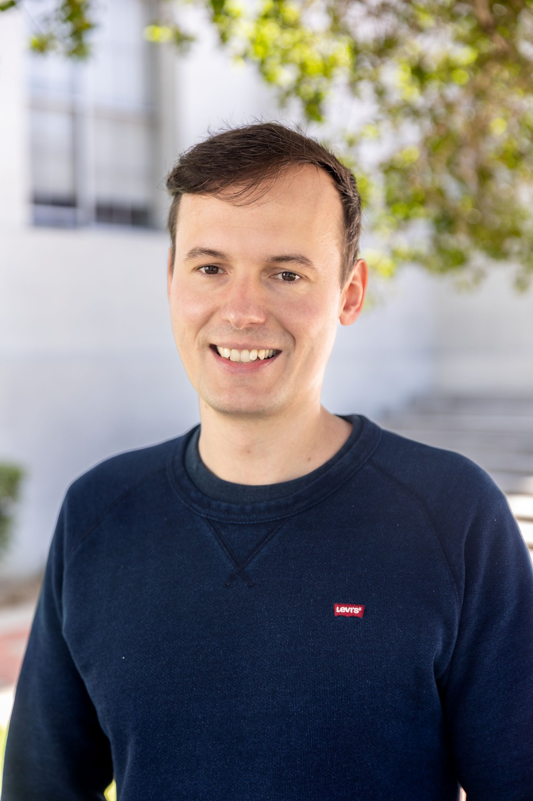

About

# About Tobias Recker

I am a postdoctoral researcher working on cooperative mobile multi-robot systems, mobile manipulation, and robotic automation for production and construction.

::: {.split}

I am Dr.-Ing. Tobias Recker, a robotics researcher at the Institute of Assembly Technology and Robotics at Leibniz University Hannover.

My work focuses on scalable production, mobile multi-robot systems, and robot-robot cooperation. I am particularly interested in robotic systems that can adapt to changing component sizes, process requirements, and production environments without requiring highly specialized single-purpose hardware.

In my dissertation, I developed a scalable framework for cooperative mobile multi-robot systems for handling and assembly of large-scale components. Beyond multi-robot manipulation, I also work on mobile manipulation, trajectory planning, hardware and system integration, and robotic automation for construction and production.

::: {.image-panel}

:::
:::

## Research interests

<ul class="tag-list">
<li>Cooperative mobile multi-robot systems</li>
<li>Mobile manipulation</li>
<li>Multi-robot control</li>
<li>Formation control</li>
<li>Trajectory planning</li>
<li>Robot learning</li>
<li>Hardware and system integration</li>
<li>Automation for construction</li>
</ul>

## Links

<a class="button primary" href="contact.html">Contact</a>
<a class="button" href="https://github.com/TobiasRecker">GitHub</a>
<a class="button" href="https://orcid.org/0000-0003-1632-0538">ORCID</a>
<a class="button" href="https://de.linkedin.com/in/tobias-recker-14349521b">LinkedIn</a>
<a class="button" href="https://www.scopus.com/authid/detail.uri?authorId=57216780652">Scopus</a>
<a class="button" href="https://www.match.uni-hannover.de/en/institute/team/tobias-recker">Institute profile</a>

