::: {.hero}
::: {.hero-text}

Research profile

# Dr.-Ing. Tobias Recker

Postdoctoral Researcher · Institute of Assembly Technology and Robotics · Leibniz University Hannover

I develop scalable cooperative mobile multi-robot systems for industrial handling, assembly, and construction automation.

I design control, trajectory planning, and system integration approaches for tightly coupled robotic cooperation. My focus is on tasks where multiple mobile robots handle one common object and where no individual robot could complete the task alone, even given unlimited time.

<a class="button primary" href="research.html">Explore research</a>
<a class="button" href="projects.html">View projects</a>
<a class="button" href="assets/pdfs/recker-dissertation-2025.pdf">Download dissertation</a>

:::

::: {.hero-portrait-wrap}
<button class="hero-stack-button" type="button" aria-label="Switch profile image" aria-pressed="false" data-photo-stack>

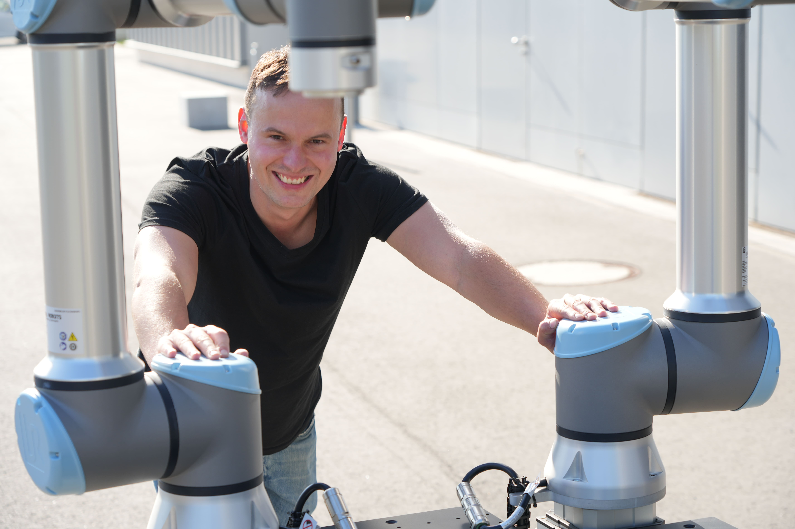

</button>
:::
:::

## Research focus

My work is centered on tightly coupled cooperation between mobile robots. I focus on scenarios where several robots handle one common object and coordinate their motion so closely that the task only exists as a team task. This is especially relevant for broad task spectra in which highly specialized robots would be expensive, underutilized, and difficult to justify.

::: {.card-grid}
::: {.card}
### Cooperative mobile multi-robot systems
Scalable control frameworks for mobile robots and mobile manipulators that jointly transport, handle, and assemble large-scale components.
:::

::: {.card}
### Mobile manipulation and control
Coordination of mobile platforms and robotic arms, including formation control, trajectory planning, and whole-body control.
:::

::: {.card}
### Automation for construction and production
Robotic automation for flexible manufacturing, large-scale assembly, and mobile additive manufacturing.
:::
:::

## Featured projects

::: {.card-grid}
::: {.project-card}
<a class="video-thumb" href="https://www.youtube.com/watch?v=7jzTUw5pK40" target="_blank" rel="noopener">
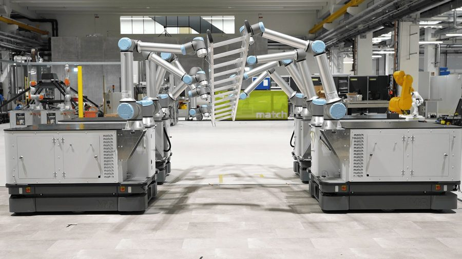
▶
</a>

Cooperative handling

### Cooperative object handling
Multiple mobile manipulators jointly grasp and move one common object in a spatial workspace.

:::

::: {.project-card}
<a class="video-thumb" href="https://www.youtube.com/watch?v=f0-cd06wfmM" target="_blank" rel="noopener">
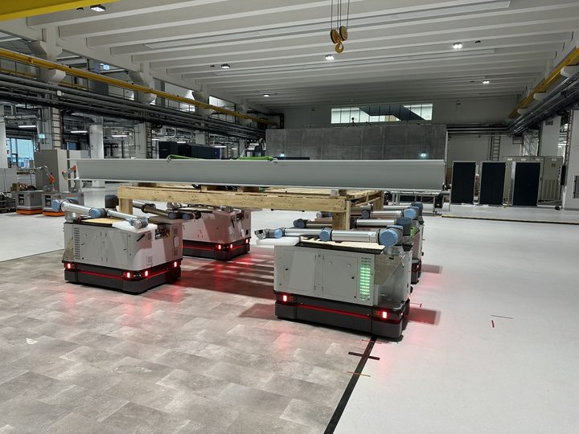
▶
</a>

Object transport

### Cooperative object transport
Mobile platforms coordinate formation motion to transport large industrial components.

:::

::: {.project-card}
<a class="video-thumb" href="https://www.youtube.com/watch?v=IAT_a7R-n6Y" target="_blank" rel="noopener">
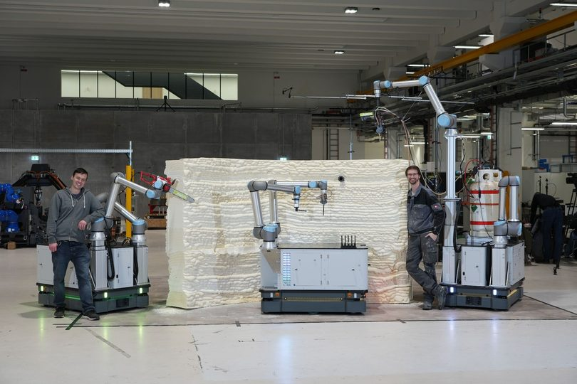
▶
</a>

Construction automation

### Print-while-drive additive manufacturing
A mobile manipulator coordinates platform and arm motion for continuous large-scale additive manufacturing.

:::
:::

<a href="projects.html">View all project details</a>

## Project gallery

A visual overview of selected demonstrators and experimental setups.

<figure>
<button class="gallery-trigger lightbox-trigger" type="button" data-lightbox-group="gallery" data-gallery-src="assets/images/gallery/Gallery04.jpg" data-gallery-title="High-payload cooperative handling" data-gallery-description="Four UR10e manipulators jointly handle a 30 kg fence post mounted on a ladder. The setup demonstrates cooperative handling at high payload and shows the control performance under a large-scale load.">
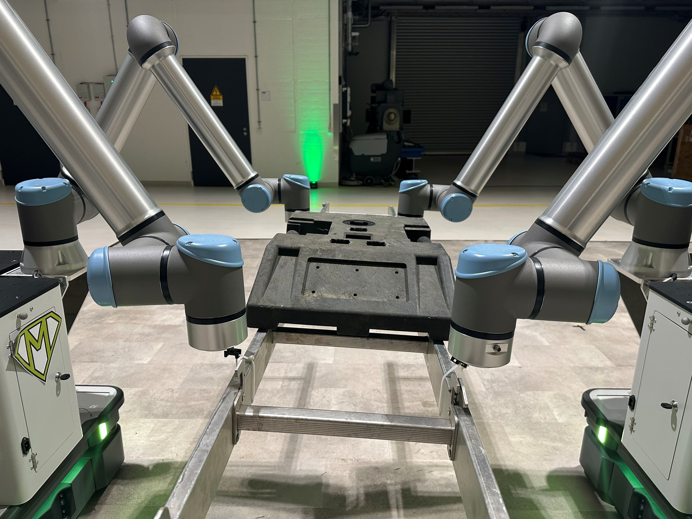
<figcaption>High-payload cooperative handling</figcaption>
</button>
</figure>
<figure>
<button class="gallery-trigger lightbox-trigger" type="button" data-lightbox-group="gallery" data-gallery-src="assets/images/gallery/Gallery03.jpg" data-gallery-title="Cooperative handling demonstrator" data-gallery-description="Four mobile manipulators jointly hold a deck chair carrying a Unitree G1. The demonstrator shows coordinated handling of one common object with a complex payload.">
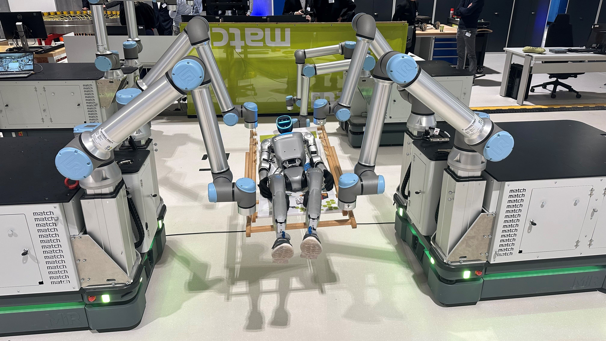
<figcaption>Cooperative handling demonstrator</figcaption>
</button>
</figure>
<figure>
<button class="gallery-trigger lightbox-trigger" type="button" data-lightbox-group="gallery" data-gallery-src="assets/images/gallery/Gallery06.jpg" data-gallery-title="Multi-axis material testing" data-gallery-description="Two manipulators deform a silicone specimen and measure wrench forces during multi-axis loading. A third manipulator simulates environmental contact and measures the resulting interaction forces.">
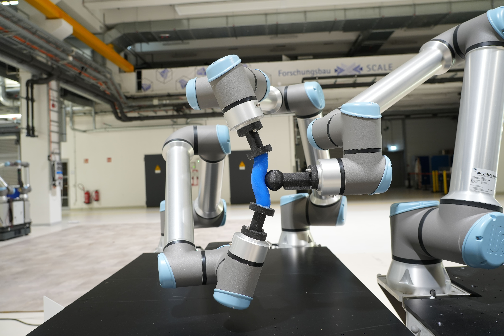
<figcaption>Multi-axis material testing</figcaption>
</button>
</figure>
<figure>
<button class="gallery-trigger lightbox-trigger" type="button" data-lightbox-group="gallery" data-gallery-src="assets/images/gallery/Gallery01.jpg" data-gallery-title="Scalable repair for large drives" data-gallery-description="A mobile multi-robot system exchanges the cooling fan motor of a large drive. The setup illustrates scalable robotic repair for large industrial equipment.">
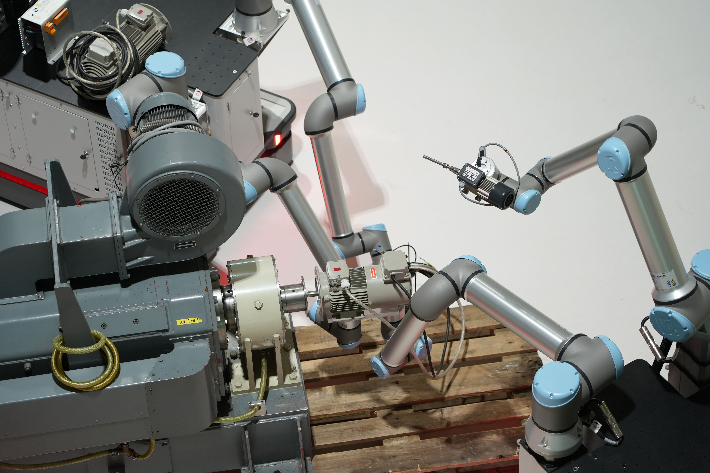
<figcaption>Scalable repair for large drives</figcaption>
</button>
</figure>
<figure>
<button class="gallery-trigger lightbox-trigger" type="button" data-lightbox-group="gallery" data-gallery-src="assets/images/gallery/Gallery05.jpg" data-gallery-title="Scalable automotive repair" data-gallery-description="A mobile multi-robot system supports the exchange of installed parts on a VW ID.3. This view shows the robots positioned around the vehicle door.">
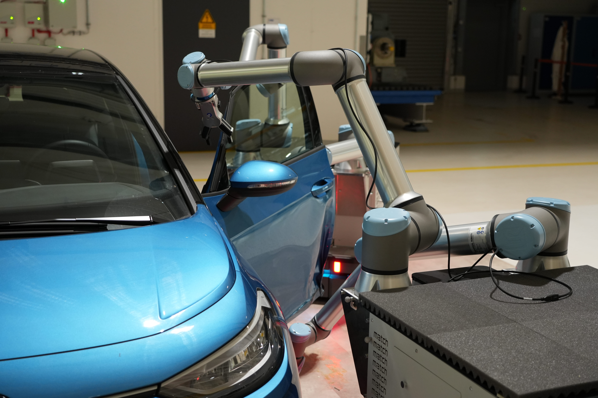
<figcaption>Scalable automotive repair</figcaption>
</button>
</figure>
<figure>
<button class="gallery-trigger lightbox-trigger" type="button" data-lightbox-group="gallery" data-gallery-src="assets/images/gallery/Gallery02.jpg" data-gallery-title="Cooperative door removal" data-gallery-description="Four robots jointly grasp the door of a VW ID.3 to lift it out of the vehicle. The scenario demonstrates cooperative handling for installed automotive components.">
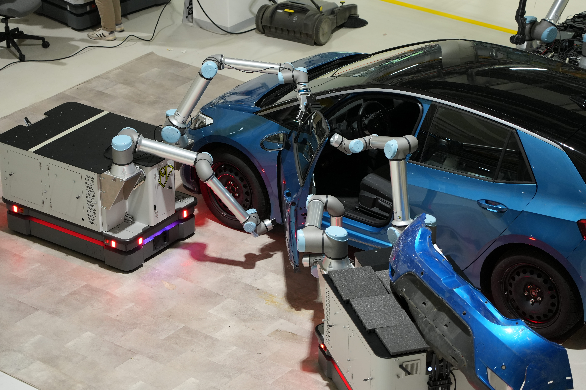
<figcaption>Cooperative door removal</figcaption>
</button>
</figure>

<dialog class="gallery-lightbox" id="gallery-lightbox" aria-labelledby="gallery-lightbox-title" aria-describedby="gallery-lightbox-description">

<button class="gallery-lightbox-close" type="button" aria-label="Close image view" data-gallery-close></button>

<h3 id="gallery-lightbox-title" data-gallery-lightbox-title></h3>

<button type="button" aria-label="Previous image" data-gallery-prev></button>
<button type="button" aria-label="Next image" data-gallery-next></button>

</dialog>

## Selected publications

<article class="publication-card">
<button class="publication-image-button lightbox-trigger" type="button" data-lightbox-group="publications" data-gallery-src="assets/images/publications/pub-01-design-control.png" data-gallery-title="Design and control of flexible handling systems" data-gallery-description="Cooperative object handling using up to eight UR10e robots.">
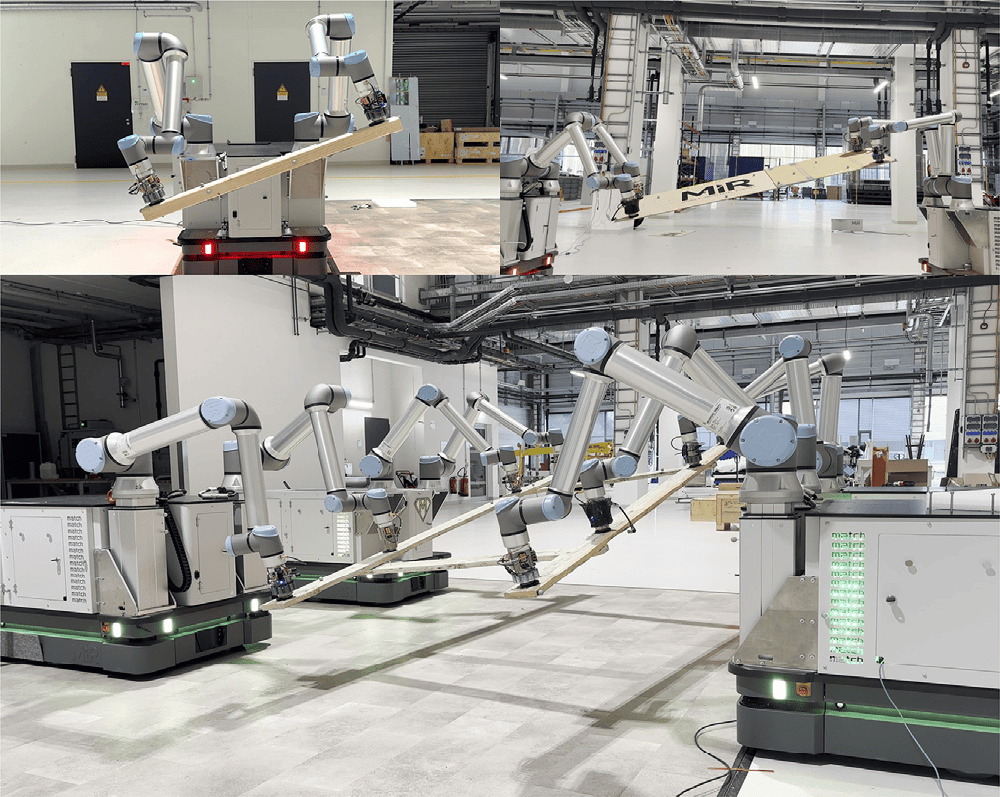
</button>

2025

<h3>Design and control of flexible handling systems based on mobile cooperative multi-robot-systems</h3>

<strong>Tobias Recker</strong>, Annika Raatz. CIRP Annals, Volume 74, Issue 1, pp. 25-29, 2025.

<a href="https://doi.org/10.1016/j.cirp.2025.04.059">DOI</a>
<a href="https://www.scopus.com/pages/publications/105018301887?origin=resultslist">Scopus</a>

</article>

<article class="publication-card">
<button class="publication-image-button lightbox-trigger" type="button" data-lightbox-group="publications" data-gallery-src="assets/images/publications/pub-02-scaling-object-handling.png" data-gallery-title="Scaling Cooperative Mobile Multi-Robot Systems for Object Handling" data-gallery-description="Payload test with a person weighing 75 kg. The experiment studies dynamic load distribution across eight manipulators.">
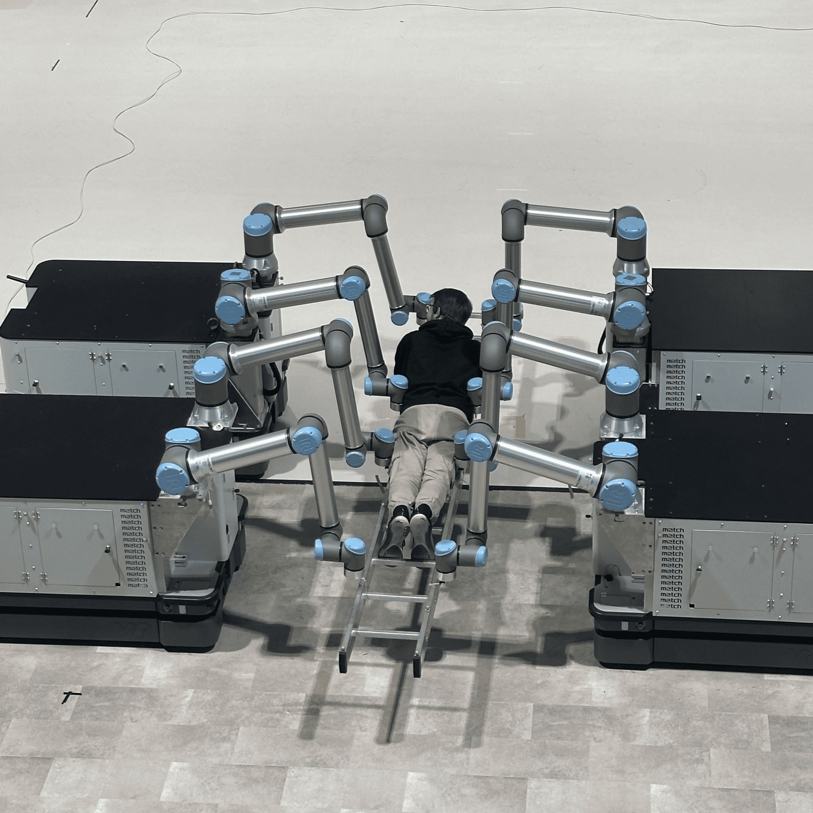
</button>

2025

<h3>Scaling Cooperative Mobile Multi-Robot Systems for Object Handling</h3>

<strong>Tobias Recker</strong>, Lukas Lachmayer, Annika Raatz. 2025 IEEE 21st International Conference on Automation Science and Engineering (CASE), Los Angeles, CA, USA, pp. 2562-2567.

<a href="https://doi.org/10.1109/CASE58245.2025.11163753">DOI</a>
<a href="https://www.youtube.com/watch?v=7jzTUw5pK40">Video</a>
<a href="https://www.scopus.com/pages/publications/105018298562?origin=resultslist">Scopus</a>

</article>

<article class="publication-card">
<button class="publication-image-button lightbox-trigger" type="button" data-lightbox-group="publications" data-gallery-src="assets/images/publications/pub-03-print-while-drive.png" data-gallery-title="Offline platform trajectory planning for print-while-drive additive manufacturing" data-gallery-description="Given a pre-defined printing trajectory, mobile additive manufacturing trajectory planning algorithms define a platform trajectory. The image shows the test setup using a MiR600 platform and UR10e arm.">
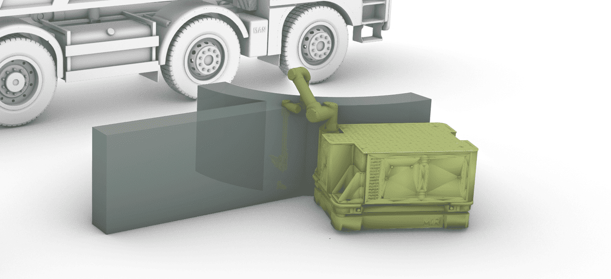
</button>

2025

<h3>Offline platform trajectory planning for print-while-drive additive manufacturing using mobile manipulators</h3>

Lukas Lachmayer, <strong>Tobias Recker</strong>, Hauke Heeren, Pitt Müller, Annika Raatz. 2025 IEEE 21st International Conference on Automation Science and Engineering (CASE), Los Angeles, CA, USA, pp. 1411-1416.

<a href="https://doi.org/10.1109/CASE58245.2025.11163995">DOI</a>
<a href="https://www.youtube.com/watch?v=IAT_a7R-n6Y">Video</a>
<a href="https://www.scopus.com/pages/publications/105003730449?origin=resultslist">Scopus</a>

</article>

<article class="publication-card">
<button class="publication-image-button lightbox-trigger" type="button" data-lightbox-group="publications" data-gallery-src="assets/images/publications/pub-04-formation-geometries.png" data-gallery-title="Semi-rigid formation geometries for cooperative object transport" data-gallery-description="Illustration of the three transport formations and objects used in this work. For reference, the I-beams shown are 3.3 m long and weigh 625 kg each.">
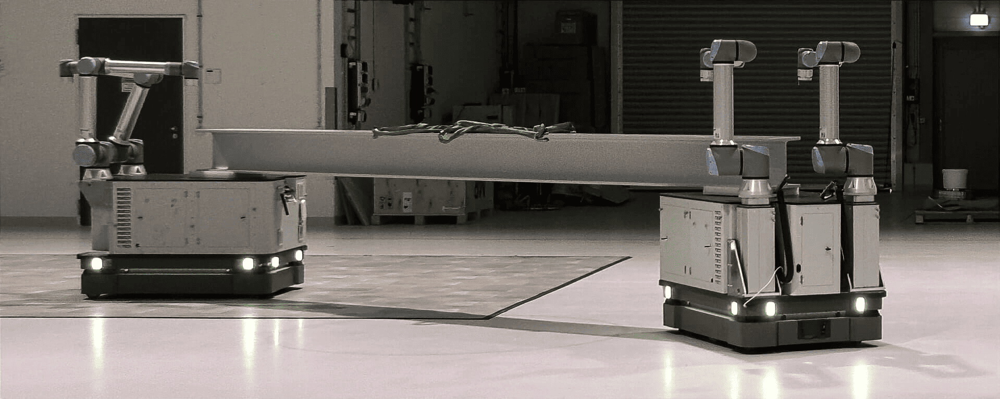
</button>

2024

<h3>A Comparative Analysis of Different Semi-Rigid Formation Geometries Regarding Multi-Robot Cooperative Object Transport for Large-Scale Objects</h3>

<strong>Tobias Recker</strong>, Henrik Lurz, Lukas Lachmayer, Annika Raatz. IEEE International Conference on Automation Science and Engineering (CASE), 2024.

<a href="https://www.scopus.com/pages/publications/85208425601?origin=resultslist">Scopus</a>

</article>

<article class="publication-card">
<button class="publication-image-button lightbox-trigger" type="button" data-lightbox-group="publications" data-gallery-src="assets/images/publications/pub-05-valet-parking.png" data-gallery-title="Design of a 6 DoF Multi-Robot Platform for Automated Multistory Valet Parking" data-gallery-description="Concept design study of the multi-robot platform. One mobile robot lifts one wheel of the car.">
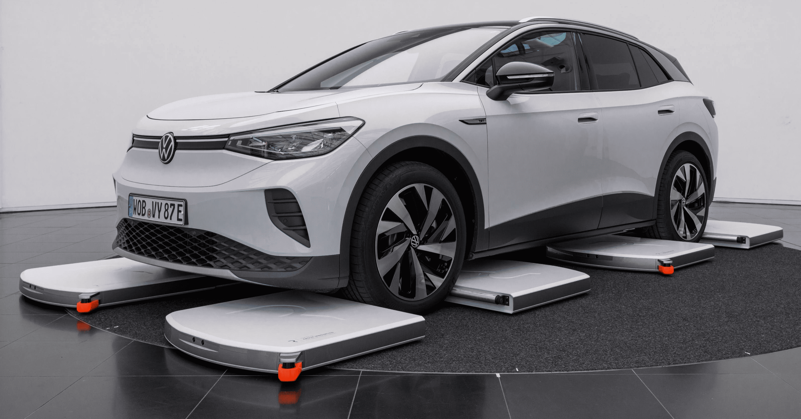
</button>

2024

<h3>Design of a 6 DoF Multi-Robot Platform for Automated Multistory Valet Parking</h3>

Moritz Springer, <strong>Tobias Recker</strong>, David Schütz, Annika Raatz. 2024 IEEE International Conference on Cybernetics and Intelligent Systems and IEEE International Conference on Robotics, Automation and Mechatronics, Hangzhou, China, pp. 290-296.

<a href="https://doi.org/10.1109/CIS-RAM61939.2024.10673400">DOI</a>
<a href="https://www.scopus.com/pages/publications/85208256597?origin=resultslist">Scopus</a>

</article>

<article class="publication-card">
<button class="publication-image-button lightbox-trigger" type="button" data-lightbox-group="publications" data-gallery-src="assets/images/publications/pub-06-inline-reinforcement.png" data-gallery-title="Inline image-based reinforcement detection" data-gallery-description="Shotcrete 3D printing at the DBFL of the ITE TU Braunschweig, including short reinforcement bar insertion and a 2D laser profiler running ahead of the printing nozzle. The goal of the paper is detecting this type of reinforcement element.">
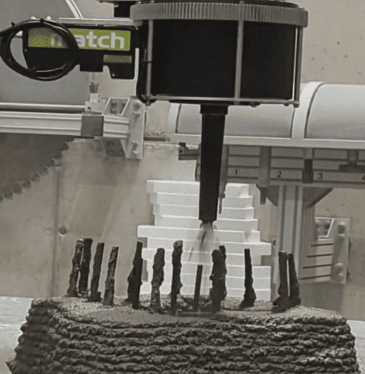
</button>

2024

<h3>Inline image-based reinforcement detection for concrete additive manufacturing processes using a convolutional neural network</h3>

Lukas Lachmayer, Leon Dittrich, <strong>Tobias Recker</strong>, Ronald Dörrie, Harald Kloft, Annika Raatz. Proceedings of the International Symposium on Automation and Robotics in Construction (ISARC), 2024.

<a href="https://doi.org/10.22260/ISARC2024/0007">DOI</a>
<a href="https://www.scopus.com/pages/publications/85203002826?origin=resultslist">Scopus</a>

</article>

<article class="publication-card">
<button class="publication-image-button lightbox-trigger" type="button" data-lightbox-group="publications" data-gallery-src="assets/images/publications/pub-07-time-efficient-path-planning.png" data-gallery-title="Time-Efficient Path Planning for Semi-Rigid Multi-Robot Formations" data-gallery-description="Parallel formation for three MiR 100 robots at different points along the SVP-planned formation path.">
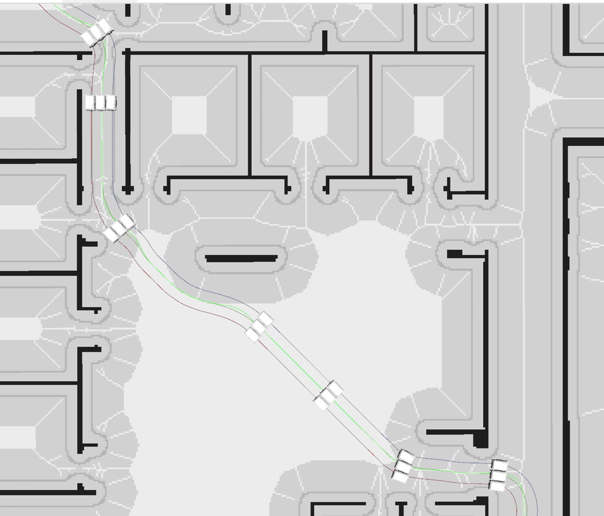
</button>

2023

<h3>Time-Efficient Path Planning for Semi-Rigid Multi-Robot Formations</h3>

<strong>Tobias Recker</strong>, Sebastian Prophet, Annika Raatz. 2023 IEEE 19th International Conference on Automation Science and Engineering (CASE), Auckland, New Zealand, pp. 1-7.

<a href="https://doi.org/10.1109/CASE56687.2023.10260434">DOI</a>
<a href="https://www.scopus.com/pages/publications/85174399024?origin=resultslist">Scopus</a>

</article>

<article class="publication-card">
<button class="publication-image-button lightbox-trigger" type="button" data-lightbox-group="publications" data-gallery-src="assets/images/publications/pub-08-mobile-additive-manufacturing.png" data-gallery-title="Additive Manufacturing using mobile robots" data-gallery-description="A pair of collaborative mobile robot research platforms for in situ additive manufacturing, each consisting of a wheeled mobile base, an integrated linear axis, and a collaborative 6-axis robot arm. One system is equipped with a clay 3D printing setup.">
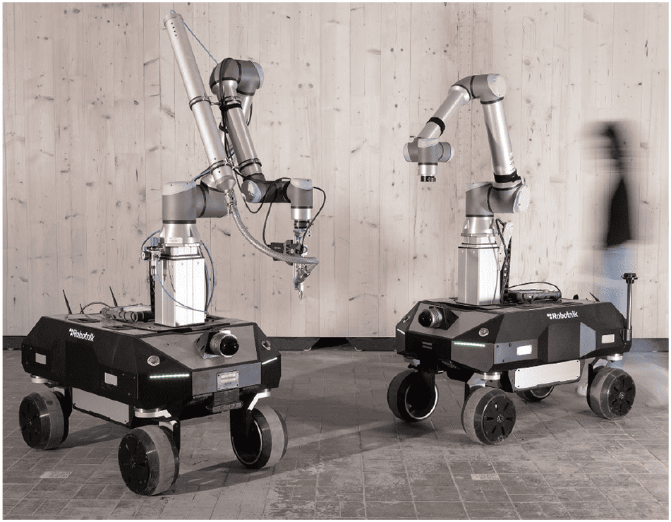
</button>

2022

<h3>Additive Manufacturing using mobile robots: Opportunities and challenges for building construction</h3>

Kathrin Dörfler, Gido Dielemans, Lukas Lachmayer, <strong>Tobias Recker</strong>, Annika Raatz, Dirk Lowke, Markus Gerke. Cement and Concrete Research, Vol. 158, 106772, 2022.

<a href="https://doi.org/10.1016/j.cemconres.2022.106772">DOI</a>
<a href="https://www.scopus.com/pages/publications/85131663569?origin=resultslist">Scopus</a>

</article>

<article class="publication-card">
<button class="publication-image-button lightbox-trigger" type="button" data-lightbox-group="publications" data-gallery-src="assets/images/publications/pub-09-smooth-spline.png" data-gallery-title="Smooth Spline-based Trajectory Planning for Semi-Rigid Multi-Robot Formations" data-gallery-description="Triangular formation of three MiR industrial robots. From left to right: virtual leader, robot 1, and robot 2.">
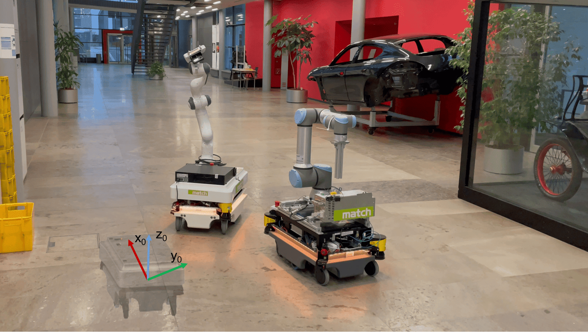
</button>

2022

<h3>Smooth Spline-based Trajectory Planning for Semi-Rigid Multi-Robot Formations</h3>

<strong>Tobias Recker</strong>, Henrik Lurz, Annika Raatz. 2022 IEEE 18th International Conference on Automation Science and Engineering (CASE), pp. 1417-1422.

<a href="https://doi.org/10.1109/CASE49997.2022.9926604">DOI</a>
<a href="https://www.scopus.com/pages/publications/85141743121?origin=resultslist">Scopus</a>

</article>

<a href="publications.html">Open publication overview</a>

## Dissertation

::: {.feature}
### Scaling of Cooperative Mobile Multi-Robot Systems for Handling and Assembly of Large-Scale Components

My dissertation investigates a scalable CMMRS framework for collaborative object handling and assembly tasks in industrial settings. It combines a hardware-agnostic control structure with path planning and experimental validation across transport, handling, and assembly-related scenarios.

<a href="dissertation.html">Dissertation summary</a>
<a href="assets/pdfs/recker-dissertation-2025.pdf">Download PDF</a>

:::

## Research keywords

<ul class="tag-list">
<li>Mobile manipulation</li>
<li>Cooperative multi-robot systems</li>
<li>Tightly coupled cooperation</li>
<li>Formation control</li>
<li>Trajectory planning</li>
<li>Robot learning</li>
<li>Hardware and system integration</li>
<li>Construction automation</li>
</ul>
