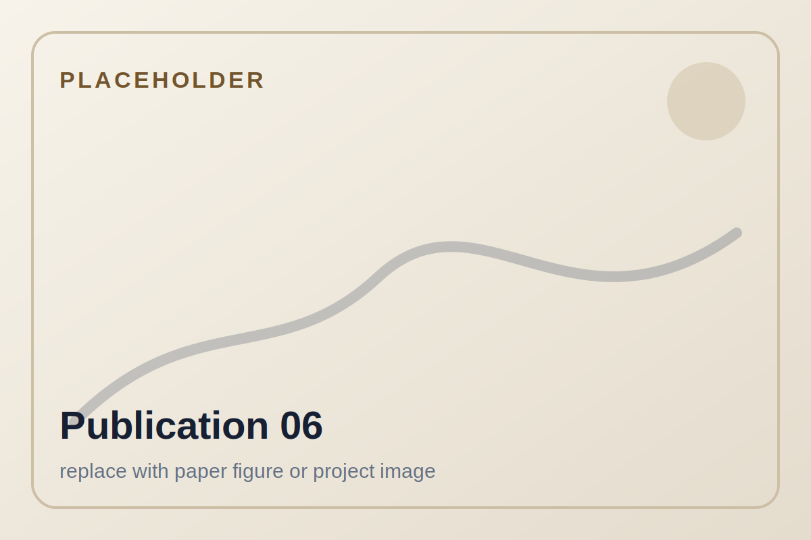
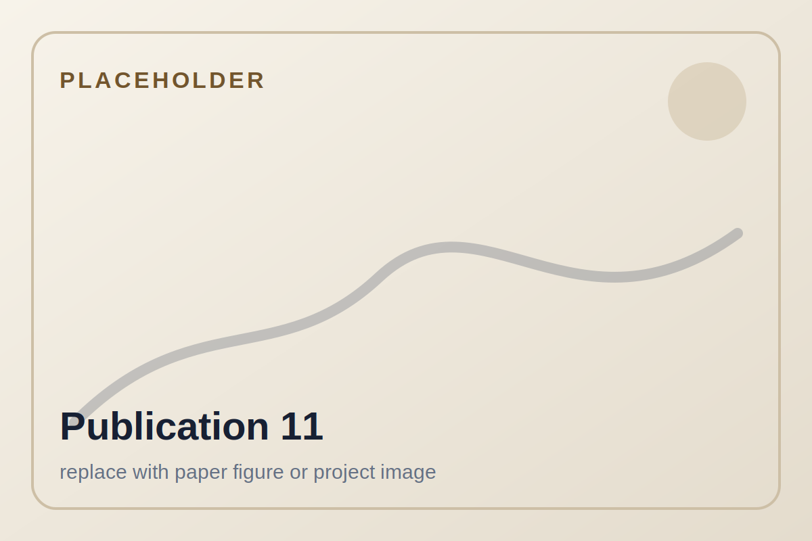

::: {.hero}
::: {.hero-text}

Research profile

# Dr.-Ing. Tobias Recker

Postdoctoral Researcher · Institute of Assembly Technology and Robotics · Leibniz University Hannover

I develop scalable cooperative mobile multi-robot systems for industrial handling, assembly, and construction automation.

I design control, trajectory planning, and system integration approaches for tightly coupled robotic cooperation. My focus is on tasks where multiple mobile robots handle one common object and where no individual robot could complete the task alone, even given unlimited time.

<a class="button primary" href="research.html">Explore research</a>
<a class="button" href="projects.html">View projects</a>
<a class="button" href="assets/pdfs/recker-dissertation-2025.pdf">Download dissertation</a>

:::

::: {.hero-portrait-wrap}

:::
:::

## Research focus

My work is centered on tightly coupled cooperation between mobile robots. I focus on scenarios where several robots handle one common object and coordinate their motion so closely that the task only exists as a team task. This is especially relevant for broad task spectra in which highly specialized robots would be expensive, underutilized, and difficult to justify.

::: {.card-grid}
::: {.card}
### Cooperative mobile multi-robot systems
Scalable control frameworks for mobile robots and mobile manipulators that jointly transport, handle, and assemble large-scale components.
:::

::: {.card}
### Mobile manipulation and control
Coordination of mobile platforms and robotic arms, including formation control, trajectory planning, and whole-body control.
:::

::: {.card}
### Automation for construction and production
Robotic automation for flexible manufacturing, large-scale assembly, and mobile additive manufacturing.
:::
:::

## Featured projects

::: {.card-grid}
::: {.project-card}
<a class="video-thumb" href="https://www.youtube.com/watch?v=7jzTUw5pK40" target="_blank" rel="noopener">

▶
</a>

Cooperative handling

### Cooperative object handling
Multiple mobile manipulators jointly grasp and move one common object in a spatial workspace.

:::

::: {.project-card}
<a class="video-thumb" href="https://www.youtube.com/watch?v=f0-cd06wfmM" target="_blank" rel="noopener">

▶
</a>

Object transport

### Cooperative object transport
Mobile platforms coordinate formation motion to transport large industrial components.

:::

::: {.project-card}
<a class="video-thumb" href="https://www.youtube.com/watch?v=IAT_a7R-n6Y" target="_blank" rel="noopener">

▶
</a>

Construction automation

### Print-while-drive additive manufacturing
A mobile manipulator coordinates platform and arm motion for continuous large-scale additive manufacturing.

:::
:::

<a href="projects.html">View all project details</a>

## Project gallery

A visual overview of selected demonstrators and experimental setups. The last images are placeholders and can be replaced once the final project photos are selected.

<figure>

<figcaption>Cooperative object handling</figcaption>
</figure>
<figure>

<figcaption>Cooperative object transport</figcaption>
</figure>
<figure>

<figcaption>Mobile additive manufacturing</figcaption>
</figure>
<figure>

<figcaption>Manipulator detail</figcaption>
</figure>
<figure>

<figcaption>Experimental setup</figcaption>
</figure>
<figure>

<figcaption>Large-scale component handling</figcaption>
</figure>

## Selected publications

<article class="publication-card">

2025

<h3>Design and control of flexible handling systems based on mobile cooperative multi-robot-systems</h3>

<strong>Tobias Recker</strong>, Annika Raatz. CIRP Annals, Volume 74, Issue 1, pp. 25-29, 2025.

<a href="https://doi.org/10.1016/j.cirp.2025.04.059">DOI</a>
<a href="https://www.scopus.com/pages/publications/105018301887?origin=resultslist">Scopus</a>

</article>

<article class="publication-card">

2025

<h3>Scaling Cooperative Mobile Multi-Robot Systems for Object Handling</h3>

<strong>Tobias Recker</strong>, Lukas Lachmayer, Annika Raatz. 2025 IEEE 21st International Conference on Automation Science and Engineering (CASE), Los Angeles, CA, USA, pp. 2562-2567.

<a href="https://doi.org/10.1109/CASE58245.2025.11163753">DOI</a>
<a href="https://www.youtube.com/watch?v=7jzTUw5pK40">Video</a>
<a href="https://www.scopus.com/pages/publications/105018298562?origin=resultslist">Scopus</a>

</article>

<article class="publication-card">

2025

<h3>Offline platform trajectory planning for print-while-drive additive manufacturing using mobile manipulators</h3>

Lukas Lachmayer, <strong>Tobias Recker</strong>, Hauke Heeren, Pitt Müller, Annika Raatz. 2025 IEEE 21st International Conference on Automation Science and Engineering (CASE), Los Angeles, CA, USA, pp. 1411-1416.

<a href="https://doi.org/10.1109/CASE58245.2025.11163995">DOI</a>
<a href="https://www.youtube.com/watch?v=IAT_a7R-n6Y">Video</a>
<a href="https://www.scopus.com/pages/publications/105003730449?origin=resultslist">Scopus</a>

</article>

<article class="publication-card">

2025

<h3>Comparison of Global Path Planning Algorithms regarding Multi Mobile Robot Object Transport Requirements</h3>

Henrik Lurz, <strong>Tobias Recker</strong>, Annika Raatz. Annals of Scientific Society for Assembly, Handling and Industrial Robotics 2023, Springer, Cham, 2025.

<a href="https://doi.org/10.1007/978-3-031-74010-7_9">DOI</a>
<a href="https://www.scopus.com/pages/publications/105001689090?origin=resultslist">Scopus</a>

</article>

<article class="publication-card">

2024

<h3>A Comparative Analysis of Different Semi-Rigid Formation Geometries Regarding Multi-Robot Cooperative Object Transport for Large-Scale Objects</h3>

<strong>Tobias Recker</strong>, Henrik Lurz, Lukas Lachmayer, Annika Raatz. IEEE International Conference on Automation Science and Engineering (CASE), 2024.

<a href="https://www.scopus.com/pages/publications/85208425601?origin=resultslist">Scopus</a>

</article>

<article class="publication-card">

2024

<h3>Design of a 6 DoF Multi-Robot Platform for Automated Multistory Valet Parking</h3>

Moritz Springer, <strong>Tobias Recker</strong>, David Schütz, Annika Raatz. 2024 IEEE International Conference on Cybernetics and Intelligent Systems and IEEE International Conference on Robotics, Automation and Mechatronics, Hangzhou, China, pp. 290-296.

<a href="https://doi.org/10.1109/CIS-RAM61939.2024.10673400">DOI</a>
<a href="https://www.scopus.com/pages/publications/85208256597?origin=resultslist">Scopus</a>

</article>

<article class="publication-card">

Digital Concrete 2024

<h3>A Spatial Multi-layer Control Concept for Strand Geometry Control in Robot-Based Additive Manufacturing Processes</h3>

Lukas Lachmayer, Jan Quantz, Hauke Heeren, <strong>Tobias Recker</strong>, Ronald Dörrie, Harald Kloft, Annika Raatz. RILEM Bookseries, Digital Concrete 2024.

<a href="https://doi.org/10.1007/978-3-031-70031-6_14">DOI</a>
<a href="https://www.scopus.com/pages/publications/85208227409?origin=resultslist">Scopus</a>

</article>

<article class="publication-card">

2024

<h3>Inline image-based reinforcement detection for concrete additive manufacturing processes using a convolutional neural network</h3>

Lukas Lachmayer, Leon Dittrich, <strong>Tobias Recker</strong>, Ronald Dörrie, Harald Kloft, Annika Raatz. Proceedings of the International Symposium on Automation and Robotics in Construction (ISARC), 2024.

<a href="https://doi.org/10.22260/ISARC2024/0007">DOI</a>
<a href="https://www.scopus.com/pages/publications/85203002826?origin=resultslist">Scopus</a>

</article>

<article class="publication-card">

2023

<h3>Time-Efficient Path Planning for Semi-Rigid Multi-Robot Formations</h3>

<strong>Tobias Recker</strong>, Sebastian Prophet, Annika Raatz. 2023 IEEE 19th International Conference on Automation Science and Engineering (CASE), Auckland, New Zealand, pp. 1-7.

<a href="https://doi.org/10.1109/CASE56687.2023.10260434">DOI</a>
<a href="https://www.scopus.com/pages/publications/85174399024?origin=resultslist">Scopus</a>

</article>

<article class="publication-card">

2022

<h3>Additive Manufacturing using mobile robots: Opportunities and challenges for building construction</h3>

Kathrin Dörfler, Gido Dielemans, Lukas Lachmayer, <strong>Tobias Recker</strong>, Annika Raatz, Dirk Lowke, Markus Gerke. Cement and Concrete Research, Vol. 158, 106772, 2022.

<a href="https://doi.org/10.1016/j.cemconres.2022.106772">DOI</a>
<a href="https://www.scopus.com/pages/publications/85131663569?origin=resultslist">Scopus</a>

</article>

<article class="publication-card">

2022

<h3>Smooth Spline-based Trajectory Planning for Semi-Rigid Multi-Robot Formations</h3>

<strong>Tobias Recker</strong>, Henrik Lurz, Annika Raatz. 2022 IEEE 18th International Conference on Automation Science and Engineering (CASE), pp. 1417-1422.

<a href="https://doi.org/10.1109/CASE49997.2022.9926604">DOI</a>
<a href="https://www.scopus.com/pages/publications/85141743121?origin=resultslist">Scopus</a>

</article>

<a href="publications.html">Open publication overview</a>

## Dissertation

::: {.feature}
### Scaling of Cooperative Mobile Multi-Robot Systems for Handling and Assembly of Large-Scale Components

My dissertation investigates a scalable CMMRS framework for collaborative object handling and assembly tasks in industrial settings. It combines a hardware-agnostic control structure with path planning and experimental validation across transport, handling, and assembly-related scenarios.

<a href="dissertation.html">Dissertation summary</a>
<a href="assets/pdfs/recker-dissertation-2025.pdf">Download PDF</a>

:::

## Research keywords

<ul class="tag-list">
<li>Mobile manipulation</li>
<li>Cooperative multi-robot systems</li>
<li>Tightly coupled cooperation</li>
<li>Formation control</li>
<li>Trajectory planning</li>
<li>Robot learning</li>
<li>Hardware and system integration</li>
<li>Construction automation</li>
</ul>
