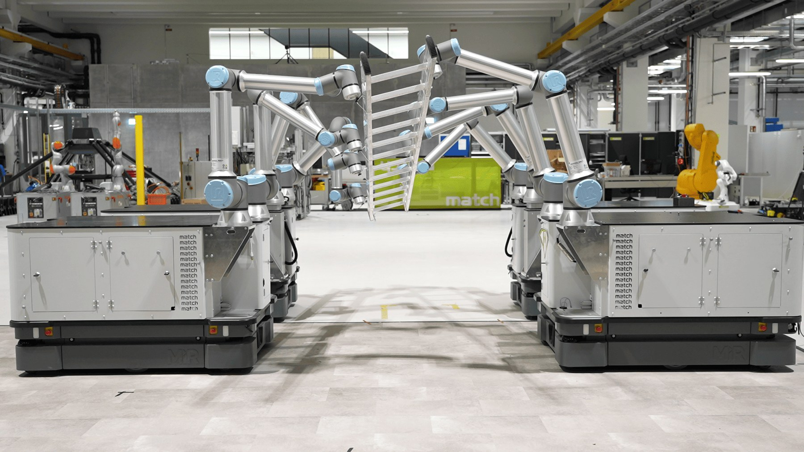
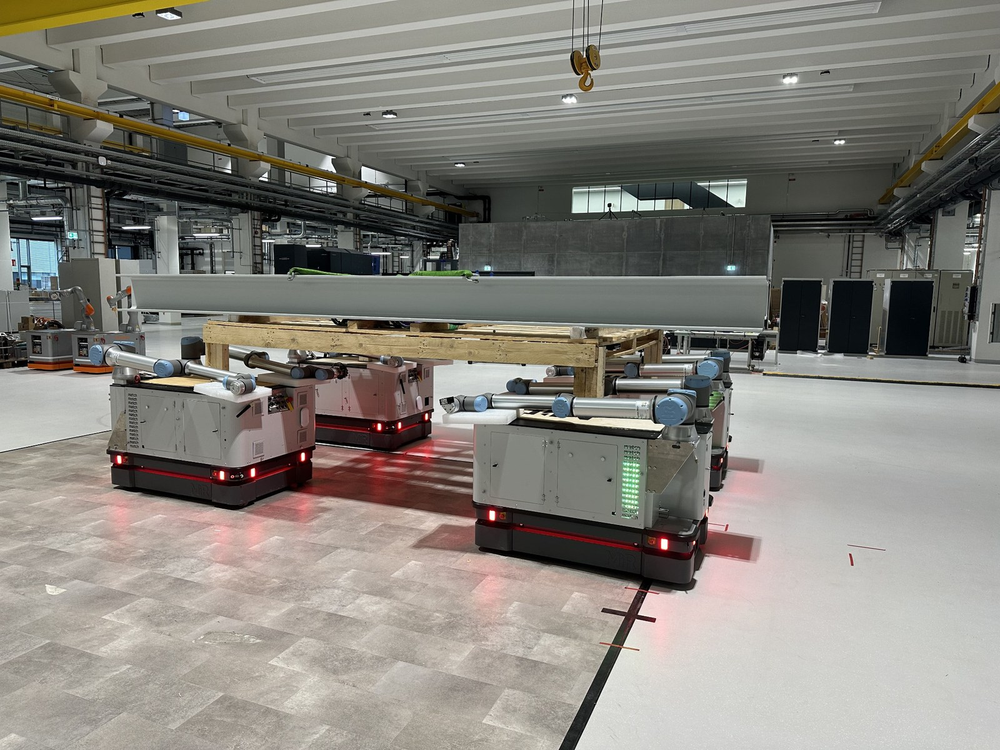
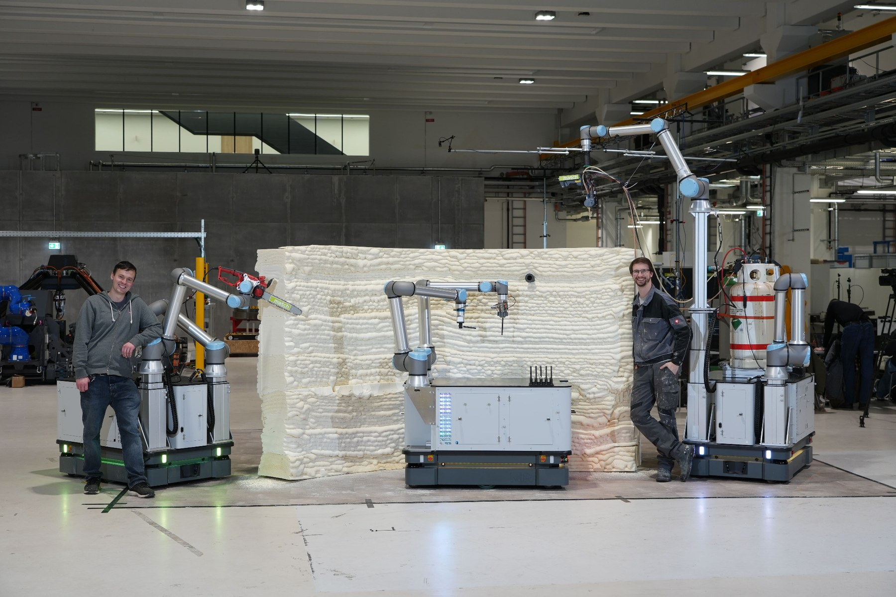

Projects

# Research demonstrators

Selected projects that show the system-level focus of my work: cooperative transport, cooperative object handling, and mobile additive manufacturing.

<section class="project-detail" id="object-handling">

<a class="video-thumb" href="https://www.youtube.com/watch?v=7jzTUw5pK40" target="_blank" rel="noopener">

▶
</a>

Cooperative object handling

## Cooperative object handling

Cooperative object handling extends multi-robot cooperation from planar transport to spatial manipulation. Multiple mobile manipulators jointly grasp and move one object in up to six degrees of freedom.

This project focuses on the control challenges that arise when several manipulators are mechanically coupled through the same object, including overdetermination, force load, workspace limitations, and adaptation to different object geometries.

**Key aspects**

- Multi-manipulator object handling
- Admittance-based and compliance-oriented control
- Handling of kinematic overdetermination
- Adaptation to different object sizes, shapes, and weights
- Experiments with up to eight manipulators

<a href="https://www.youtube.com/watch?v=7jzTUw5pK40">Video</a>
<a href="https://doi.org/10.1109/CASE58245.2025.11163753">CASE 2025 paper</a>
<a href="dissertation.html">Dissertation</a>

</section>

<section class="project-detail" id="object-transport">

<a class="video-thumb" href="https://www.youtube.com/watch?v=f0-cd06wfmM" target="_blank" rel="noopener">

▶
</a>

Cooperative object transport

## Cooperative object transport

Cooperative object transport investigates how multiple mobile robot platforms can jointly move large-scale objects through industrial environments.

The work focuses on scalable formation control, curvature-aware path planning, and the evaluation of different formation geometries such as serial, parallel, and arbitrary formations.

**Key aspects**

- Formation control for nonholonomic mobile robots
- Cooperative transport of large-scale objects
- Path-curvature constraints
- Object slippage and tracking error evaluation
- Scalability across different robot formations

<a href="https://www.youtube.com/watch?v=f0-cd06wfmM">Video</a>
<a href="dissertation.html">Dissertation</a>
<a href="publications.html">Related publications</a>

</section>

<section class="project-detail" id="additive-manufacturing">

<a class="video-thumb" href="https://www.youtube.com/watch?v=IAT_a7R-n6Y" target="_blank" rel="noopener">

▶
</a>

Construction automation

## Print-while-drive additive manufacturing

This project investigates trajectory planning for mobile manipulators that perform additive manufacturing while the mobile platform is moving.

Instead of separating driving and printing into discrete steps, the robot continuously coordinates platform motion and manipulator motion to extend the reachable workspace and enable large-scale additive manufacturing processes.

**Key aspects**

- Mobile additive manufacturing
- Offline platform trajectory planning
- Coordinated platform-manipulator motion
- Construction automation
- Large-scale robotic fabrication

<a href="https://www.youtube.com/watch?v=IAT_a7R-n6Y">Video</a>
<a href="https://doi.org/10.1109/CASE58245.2025.11163995">CASE 2025 paper</a>
<a href="publications.html">Related publications</a>

</section>

## Privacy-friendly video handling

The videos above are not embedded. Each project uses a locally hosted thumbnail and opens YouTube only after clicking the play button.
