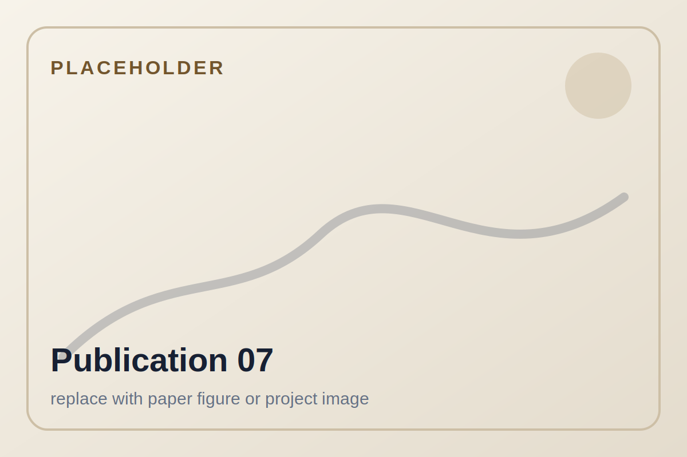

Publications

# Selected publications

A curated list of publications that represent my research on cooperative mobile multi-robot systems, mobile manipulation, trajectory planning, and construction automation.

<article class="publication-card">
<button class="publication-image-button lightbox-trigger" type="button" data-lightbox-group="publications" data-gallery-src="assets/images/publications/pub-01-design-control.png" data-gallery-title="Design and control of flexible handling systems" data-gallery-description="Cooperative object handling using up to eight UR10e robots.">

</button>

2025

<h3>Design and control of flexible handling systems based on mobile cooperative multi-robot-systems</h3>

<strong>Tobias Recker</strong>, Annika Raatz. CIRP Annals, Volume 74, Issue 1, pp. 25-29, 2025.

Flexible handling systems based on mobile cooperative multi-robot systems for scalable industrial object handling.

<a href="https://doi.org/10.1016/j.cirp.2025.04.059">DOI</a>
<a href="https://www.scopus.com/pages/publications/105018301887?origin=resultslist">Scopus</a>

</article>

<article class="publication-card">
<button class="publication-image-button lightbox-trigger" type="button" data-lightbox-group="publications" data-gallery-src="assets/images/publications/pub-02-scaling-object-handling.png" data-gallery-title="Scaling Cooperative Mobile Multi-Robot Systems for Object Handling" data-gallery-description="Payload test with a person weighing 75 kg. The experiment studies dynamic load distribution across eight manipulators.">

</button>

2025

<h3>Scaling Cooperative Mobile Multi-Robot Systems for Object Handling</h3>

<strong>Tobias Recker</strong>, Lukas Lachmayer, Annika Raatz. 2025 IEEE 21st International Conference on Automation Science and Engineering (CASE), Los Angeles, CA, USA, pp. 2562-2567.

A scalable cooperative mobile multi-robot framework for object handling with multiple mobile manipulators.

<a href="https://doi.org/10.1109/CASE58245.2025.11163753">DOI</a>
<a href="https://www.youtube.com/watch?v=7jzTUw5pK40">Video</a>
<a href="https://www.scopus.com/pages/publications/105018298562?origin=resultslist">Scopus</a>

</article>

<article class="publication-card">
<button class="publication-image-button lightbox-trigger" type="button" data-lightbox-group="publications" data-gallery-src="assets/images/publications/pub-03-print-while-drive.png" data-gallery-title="Offline platform trajectory planning for print-while-drive additive manufacturing" data-gallery-description="Given a pre-defined printing trajectory, mobile additive manufacturing trajectory planning algorithms define a platform trajectory. The image shows the test setup using a MiR600 platform and UR10e arm.">

</button>

2025

<h3>Offline platform trajectory planning for print-while-drive additive manufacturing using mobile manipulators</h3>

Lukas Lachmayer, <strong>Tobias Recker</strong>, Hauke Heeren, Pitt Müller, Annika Raatz. 2025 IEEE 21st International Conference on Automation Science and Engineering (CASE), Los Angeles, CA, USA, pp. 1411-1416.

Trajectory planning for coordinated platform and manipulator motion in continuous mobile additive manufacturing.

<a href="https://doi.org/10.1109/CASE58245.2025.11163995">DOI</a>
<a href="https://www.youtube.com/watch?v=IAT_a7R-n6Y">Video</a>
<a href="https://www.scopus.com/pages/publications/105003730449?origin=resultslist">Scopus</a>

</article>

<article class="publication-card">
<button class="publication-image-button lightbox-trigger" type="button" data-lightbox-group="publications" data-gallery-src="assets/images/publications/pub-04-formation-geometries.png" data-gallery-title="Semi-rigid formation geometries for cooperative object transport" data-gallery-description="Illustration of the three transport formations and objects used in this work. For reference, the I-beams shown are 3.3 m long and weigh 625 kg each.">

</button>

2024

<h3>A Comparative Analysis of Different Semi-Rigid Formation Geometries Regarding Multi-Robot Cooperative Object Transport for Large-Scale Objects</h3>

<strong>Tobias Recker</strong>, Henrik Lurz, Lukas Lachmayer, Annika Raatz. IEEE International Conference on Automation Science and Engineering (CASE), 2024.

Evaluation of formation geometries for cooperative object transport with multiple mobile robots.

<a href="https://www.scopus.com/pages/publications/85208425601?origin=resultslist">Scopus</a>

</article>

<article class="publication-card">
<button class="publication-image-button lightbox-trigger" type="button" data-lightbox-group="publications" data-gallery-src="assets/images/publications/pub-05-valet-parking.png" data-gallery-title="Design of a 6 DoF Multi-Robot Platform for Automated Multistory Valet Parking" data-gallery-description="Concept design study of the multi-robot platform. One mobile robot lifts one wheel of the car.">

</button>

2024

<h3>Design of a 6 DoF Multi-Robot Platform for Automated Multistory Valet Parking</h3>

Moritz Springer, <strong>Tobias Recker</strong>, David Schütz, Annika Raatz. 2024 IEEE International Conference on Cybernetics and Intelligent Systems and IEEE International Conference on Robotics, Automation and Mechatronics, Hangzhou, China, pp. 290-296.

A multi-robot platform concept for automated multistory valet parking with six degrees of freedom.

<a href="https://doi.org/10.1109/CIS-RAM61939.2024.10673400">DOI</a>
<a href="https://www.scopus.com/pages/publications/85208256597?origin=resultslist">Scopus</a>

</article>

<article class="publication-card">

Digital Concrete 2024

<h3>A Spatial Multi-layer Control Concept for Strand Geometry Control in Robot-Based Additive Manufacturing Processes</h3>

Lukas Lachmayer, Jan Quantz, Hauke Heeren, <strong>Tobias Recker</strong>, Ronald Dörrie, Harald Kloft, Annika Raatz. RILEM Bookseries, Digital Concrete 2024.

A control concept for strand geometry in robot-based additive manufacturing processes.

<a href="https://doi.org/10.1007/978-3-031-70031-6_14">DOI</a>
<a href="https://www.scopus.com/pages/publications/85208227409?origin=resultslist">Scopus</a>

</article>

<article class="publication-card">
<button class="publication-image-button lightbox-trigger" type="button" data-lightbox-group="publications" data-gallery-src="assets/images/publications/pub-06-inline-reinforcement.png" data-gallery-title="Inline image-based reinforcement detection" data-gallery-description="Shotcrete 3D printing at the DBFL of the ITE TU Braunschweig, including short reinforcement bar insertion and a 2D laser profiler running ahead of the printing nozzle. The goal of the paper is detecting this type of reinforcement element.">

</button>

2024

<h3>Inline image-based reinforcement detection for concrete additive manufacturing processes using a convolutional neural network</h3>

Lukas Lachmayer, Leon Dittrich, <strong>Tobias Recker</strong>, Ronald Dörrie, Harald Kloft, Annika Raatz. Proceedings of the International Symposium on Automation and Robotics in Construction (ISARC), 2024.

Image-based reinforcement detection for concrete additive manufacturing using a convolutional neural network.

<a href="https://doi.org/10.22260/ISARC2024/0007">DOI</a>
<a href="https://www.scopus.com/pages/publications/85203002826?origin=resultslist">Scopus</a>

</article>

<article class="publication-card">
<button class="publication-image-button lightbox-trigger" type="button" data-lightbox-group="publications" data-gallery-src="assets/images/publications/pub-07-time-efficient-path-planning.png" data-gallery-title="Time-Efficient Path Planning for Semi-Rigid Multi-Robot Formations" data-gallery-description="Parallel formation for three MiR 100 robots at different points along the SVP-planned formation path.">

</button>

2023

<h3>Time-Efficient Path Planning for Semi-Rigid Multi-Robot Formations</h3>

<strong>Tobias Recker</strong>, Sebastian Prophet, Annika Raatz. 2023 IEEE 19th International Conference on Automation Science and Engineering (CASE), Auckland, New Zealand, pp. 1-7.

Path planning for semi-rigid multi-robot formations with a focus on efficient computation.

<a href="https://doi.org/10.1109/CASE56687.2023.10260434">DOI</a>
<a href="https://www.scopus.com/pages/publications/85174399024?origin=resultslist">Scopus</a>

</article>

<article class="publication-card">
<button class="publication-image-button lightbox-trigger" type="button" data-lightbox-group="publications" data-gallery-src="assets/images/publications/pub-08-mobile-additive-manufacturing.png" data-gallery-title="Additive Manufacturing using mobile robots" data-gallery-description="A pair of collaborative mobile robot research platforms for in situ additive manufacturing, each consisting of a wheeled mobile base, an integrated linear axis, and a collaborative 6-axis robot arm. One system is equipped with a clay 3D printing setup.">

</button>

2022

<h3>Additive Manufacturing using mobile robots: Opportunities and challenges for building construction</h3>

Kathrin Dörfler, Gido Dielemans, Lukas Lachmayer, <strong>Tobias Recker</strong>, Annika Raatz, Dirk Lowke, Markus Gerke. Cement and Concrete Research, Vol. 158, 106772, 2022.

Opportunities and challenges of using mobile robots for additive manufacturing in building construction.

<a href="https://doi.org/10.1016/j.cemconres.2022.106772">DOI</a>
<a href="https://www.scopus.com/pages/publications/85131663569?origin=resultslist">Scopus</a>

</article>

<article class="publication-card">
<button class="publication-image-button lightbox-trigger" type="button" data-lightbox-group="publications" data-gallery-src="assets/images/publications/pub-09-smooth-spline.png" data-gallery-title="Smooth Spline-based Trajectory Planning for Semi-Rigid Multi-Robot Formations" data-gallery-description="Triangular formation of three MiR industrial robots. From left to right: virtual leader, robot 1, and robot 2.">

</button>

2022

<h3>Smooth Spline-based Trajectory Planning for Semi-Rigid Multi-Robot Formations</h3>

<strong>Tobias Recker</strong>, Henrik Lurz, Annika Raatz. 2022 IEEE 18th International Conference on Automation Science and Engineering (CASE), pp. 1417-1422.

Spline-based trajectory planning for smooth motion of semi-rigid multi-robot formations.

<a href="https://doi.org/10.1109/CASE49997.2022.9926604">DOI</a>
<a href="https://www.scopus.com/pages/publications/85141743121?origin=resultslist">Scopus</a>

</article>

## Profiles

<a class="button primary" href="https://www.scopus.com/authid/detail.uri?authorId=57216780652">Scopus profile</a>
<a class="button" href="https://orcid.org/0000-0003-1632-0538">ORCID</a>
<a class="button" href="https://www.match.uni-hannover.de/en/institut/team/tobias-recker/publikationsliste">Institute publication list</a>

## BibTeX

A small starter BibTeX file is included in the website repository at `assets/data/references.bib`.

